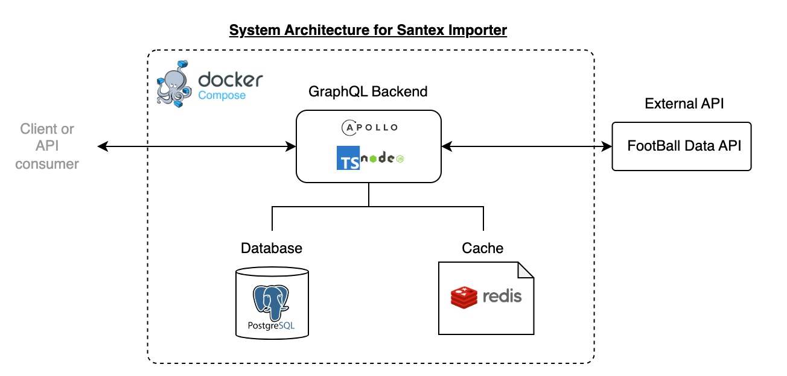
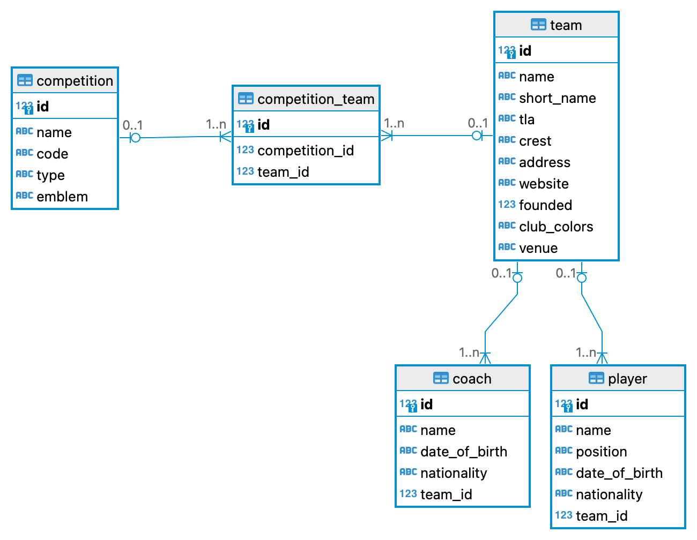
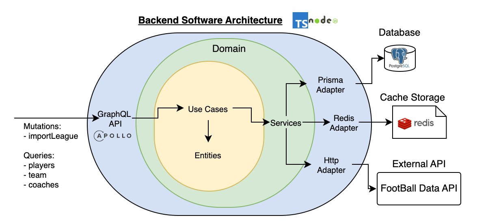

# GraphQL Backend Architecture with Typescript and Docker

### Table of contents

1. [System Architecture](#system-architecture)
2. [How to run](#how-to-run)
3. [How to interact with the backend](#how-to-interact)
4. [Unit testing](#unit-testing)
5. [Additional Configuration](#additional-configuration)

# SYSTEM ARCHITECTURE

The whole system is managed using `docker compose`. Inside there are 3 services:

-   A main **postgres database**. It automatically creates tables and relationships the first time docker compose builds the service.
-   A **redis service** used to control the limit and frequency usage of the free tier token for the FootballData API.
-   The GraphQL **backend service**.

This diagram describes the system architecture:


## DATABASE - Postgres

I chose a Relational Database (Postgres) as the primary DB since the data structure requires handling relationships. For example, `Teams` and `Competitions` behave according to a `many-to-many` relationship.

All tables are contained in a schema called `importer` since the service will import data. After normalization, the designed entity-relationship diagram for all the tables is described in the following image:


## CACHE - Redis

In order to prevent Football-Data free token to reach its limit of 10 invocations per minute, the backend will have a lower limit of calls to the Football-Data API.

The backend stores in Redis the timestamp of each invocation to FootBall-Data API to execute this control.
For demonstrations purposes the current limit is set to 8, its value can be modified at `src/shared/config.ts`.

## BACKEND - Node & Apollo

For the backend software architecture I followed [Clean Architecture](https://blog.cleancoder.com/uncle-bob/2012/08/13/the-clean-architecture.html) since I assumed this to be a scalable, robust and testable service. Of course due to time constraints I prioritized the implementation of certain components, but have implemented dependencies injection in order to facilitate unit testing. The software architecture implemented goes as the following image:


The implementation details (specific frameworks and libraries) are isolated from the core business logic at `src/domain`, making it testable and easy to maintain.

Technologies used:

-   Apollo Server is used to rapidly expose a GraphQL API for the service.
-   Prisma is used as the ORM since it provides automatic schema generation extracting the actual design from the database, giving efficiencies at developing time.
-   Typescript, again for efficiencies and error reduction during developing time.

# HOW TO RUN

Here is [a short video](https://drive.google.com/file/d/1T1DvjurN559MGIOpPnRHnQXcCIisBQpD/view?usp=sharing) of the system being built with docker compose and used.

### Turn on the backend using docker compose:

```
docker compose up
```

This will start 3 services:

-   The main database, and it will create its schema, tables and relationships the first time;
-   A cache service and
-   The GraphQL backend.
    Once you see the message in your terminal `Running backend at port 4000` you can interact with the backend.

# HOW TO INTERACT

This [same video](https://drive.google.com/file/d/1T1DvjurN559MGIOpPnRHnQXcCIisBQpD/view?usp=sharing) demonstrate how to use the app using Apollo Sandbox.

### Use Apollo Sandbox to interact with the backend:

After docker prints `Running backend at port 4000`, the system starts apollo sandbox at port 4000. Go to [this url](http://localhost:4000/) in your browser:

```
http://localhost:4000/
```

Here you can execute any Query and Mutation provided by the interface and test the ones specified in the challenge.

# UNIT TESTING

Here is another [a short video](https://drive.google.com/file/d/1c8S1QkqZceLEFS2ry_UOWPaDBaDYCXGR/view?usp=sharing) of the unit tests being executed.

### Install dependencies and run `npm run test`.

I chose Vitest as the testing library since is lighter, easy to set up for Typescript, and is constantly being maintained compared to alternatives as Jest, although the api is almost identical.
Just install all dependencies to make sure to have everything needed.

```
npm install
```

And execute the test command:

```
npm run test
```

Currently there are basic unit tests for the following scenarios specified as important in the challenge description:

-   **Prevent calls to external Football-Data API** limiting to set the maximum numbers of invocations bellow its limit of 10 invocations per minute. Currently the backend limit is set to 8 for demonstration purposes.
-   **importLeague**:
-   -   Given a valid `leagueCode` should import a competition, its teams, its players and coaches to the database and return the competition.
-   -   Should throw error when the provided `leagueCode` is not valid.
-   **players**:
-   -   Should retrieve the list of players from databse for a given `leagueCode`
-   **team**:
-   -   Should return a team from database given a valid `teamName` and its players and coach if desired.

# Additional configuration

## Prisma

Use `npx prisma pull db` to generate prisma schema from database.
Use `npx prisma generate` to generate a client for the backend to use.

## Env files

In order for the app to run you need to create two .env files at the root of your project with the following formats. For this you need your football-data API_KEY.

**.env.db**

```
POSTGRES_PASSWORD=league_pwd
POSTGRES_USER=league_backend
POSTGRES_DB=league_db
```

**.env.backend**

```
DATABASE_URL="postgresql://league_backend:league_pwd@db:5432/league_db?schema=importer"
REDIS_HOST=redis
REDIS_PORT=6379
BASE_FOOTBALL_API_URL="https://api.football-data.org/v4/"
FOOTBALL_DATA_API_KEY=<YOUR_API_KEY>
```
